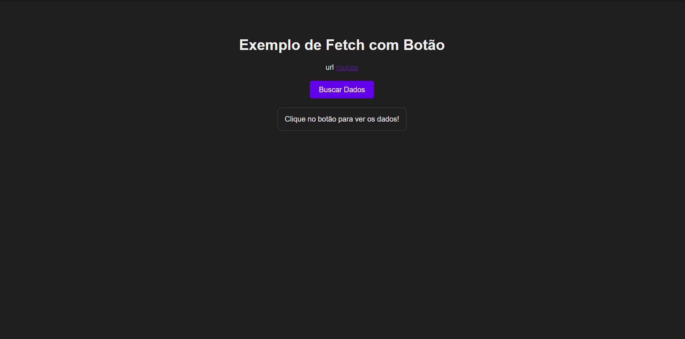

# Loja de roupas API REST👔



### Sobre o projeto [Link API](https://danielbatata.pythonanywhere.com/) 💪

> Pequeno projeto estudos uma api para simular uma loja de roupa

## Requisitos 💻

Antes de clonar o projeto e recomendado você ter os seguintes requisitos:

-   Precisa ter `Python 3+` instalado.
-   Necessario `GIT` para clonar.
-   Sua maquina `Windows, Linux ou Mac`.
-   Conhecimento basico em `Django + RestFramework`.

## Tecnologias 🚀

As principais tecnologias e ferramentas utilizadas neste projeto são:

-   `Python`: Uma linguagem de programação de alto nível, conhecida por sua sintaxe simples e legível. sendo possivel utilizar em desenvolvimento web, ciência de dados, automação e inteligência artificial.
-   `Django`: É um framework web de alto nível desenvolvido em Python, com o desenvolvimento rápido e seguro. Ele segue o padrão MVC (Model-View-Controller) alem de incluir recursos integrados. Django é ideal para construir aplicações web robustas e escaláveis..
-   `Django-Rest-Framework`: É uma extensão do Django voltada para a criação de APIs RESTful. Facilita o desenvolvimento de APIs com suporte a autenticação, permissão, serialização de dados e respostas em JSON. DRF é amplamente utilizado para fornecer back-ends que podem ser consumidos por aplicações frontend ou serviços móveis.

## Como instalar 🚀

Windows, Linux e macOS

```
git clone https://github.com/danielBRTanimacao/loja-de-roupa-api-rest.git

cd loja-de-roupa-api-rest

python -m venv venv

source venv/bin/activate "on linux and macOs"
venv\Scripts\activate "on Windows"

pip install -r requirements.txt
python manage.py migrate
python manage.py runserver
```

### Contato 📞

-   Nome: Daniel Tenório
-   Email: danieltenorio2046@gmail.com
-   LinkedIn: [Meu LinkedIn](https://www.linkedin.com/in/daniel-tenório-6471b0244/)
